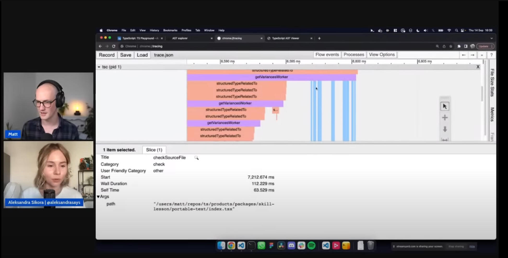

# Performance

::: info
This topic topic is quite new some developer discssion about TypeScript Performance and how to improve it.
:::

Are you looking to optimize your TypeScript code for better performance? This talk will guide you through identifying and resolving performance issues in TypeScript. She cover effective debugging techniques, leveraging the TypeScript compiler to spot potential problems, and using profiling tools to trace and fix bottlenecks. By mastering these methods, you'll be able to enhance the efficiency and maintainability of your TypeScript projects.

[Aleksandra Sikora](https://x.com/aleksandrasays) - Typescript Performance: Going Beyond The Surface, here is video summary:

**Breaking Down Large Type Helpers**

TypeScript's type helpers are powerful tools for defining complex types, but when they become too large, they can negatively impact performance. By breaking a large type helper, like a 60-line `ComputeThing<T>`, into smaller, more focused type helpers, you allow TypeScript to cache these smaller pieces more effectively. This practice not only improves performance but also makes the codebase easier to maintain and understand. Smaller type helpers are more modular and can be reused in different parts of the application.

**Using `tsc --generateTrace` for Performance Tracing**

TypeScript provides a built-in tool for generating performance traces, which can be extremely useful for identifying performance bottlenecks in your TypeScript code. The command `tsc --generateTrace outDir` generates a set of JSON files in the specified output directory (`outDir`). These JSON files can be imported into Chrome Dev Tools, which provides a visual representation of the performance trace. In Chrome Dev Tools, you can analyze the traces to see which parts of your TypeScript code are taking the most time to compile. This detailed information helps in pinpointing specific files or types that are causing performance issues, allowing you to optimize them for better performance.

By breaking down type helpers and using performance tracing tools, you can significantly improve the efficiency and maintainability of your TypeScript codebase.

## TypeScript Performance Walkthrough

You can watch the full talk on [TypeScript Performance with Aleksandra Sikora](https://www.youtube.com/watch?v=ZL3z1oBZntk) by Matt Pocock and Aleksandra Sikora